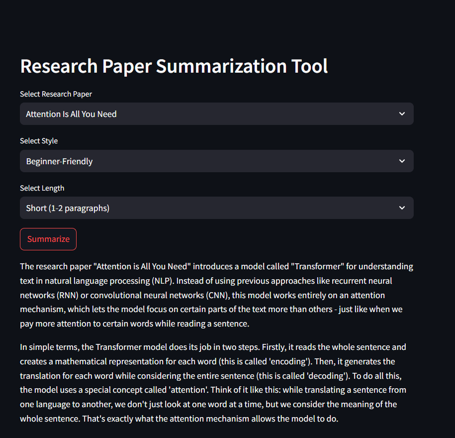

# Research Paper Summarization Tool

## Project Overview

This project is a streamlined **LLM-based web application** that allows users to generate summaries of influential AI research papers in different styles and lengths. Built with **Streamlit**, **LangChain**, and **OpenAI’s GPT-4**, it delivers a flexible summarization interface for students, professionals, and researchers.

The summarizer supports predefined paper selections and customizable summary styles, making it beginner-friendly and highly adaptable to user needs.

## Key Technologies and Concepts Covered

- **Streamlit**: Lightweight Python framework used to build the interactive user interface.
- **LangChain**: Used to manage prompt templates and LLM chains for structured summarization.
- **ChatOpenAI (GPT-4)**: Language model used for generating summaries based on user input.
- **Prompt Template**: Summary behavior is driven by a structured prompt loaded from a `template.json` file.
- **Dotenv**: `.env` file is used to securely load the OpenAI API key into the environment.

## Application Flow

1. **User Input**
   - Select a research paper from a predefined list of influential AI papers.
   - Choose the desired summary style:
     - Beginner-Friendly
     - Technical
     - Code-Oriented
     - Mathematical
   - Choose the desired summary length:
     - Short (1–2 paragraphs)
     - Medium (3–5 paragraphs)
     - Long (detailed explanation)

2. **Prompt Loading**
   - A custom prompt template is loaded from `template.json` using LangChain.

3. **Summary Generation**
   - The inputs are passed into a LangChain chain that uses the GPT-4 model to generate a summary.
   - The result is displayed in the Streamlit app.

